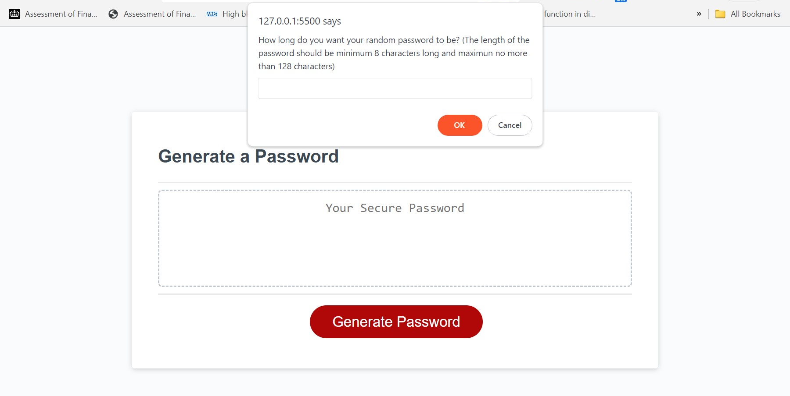
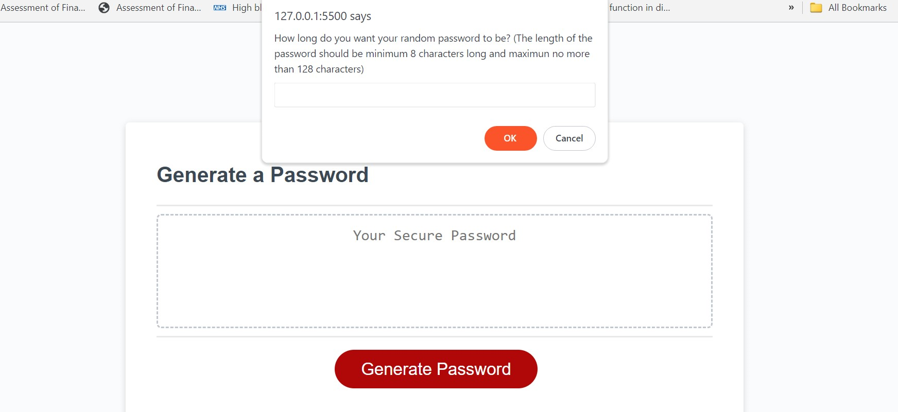
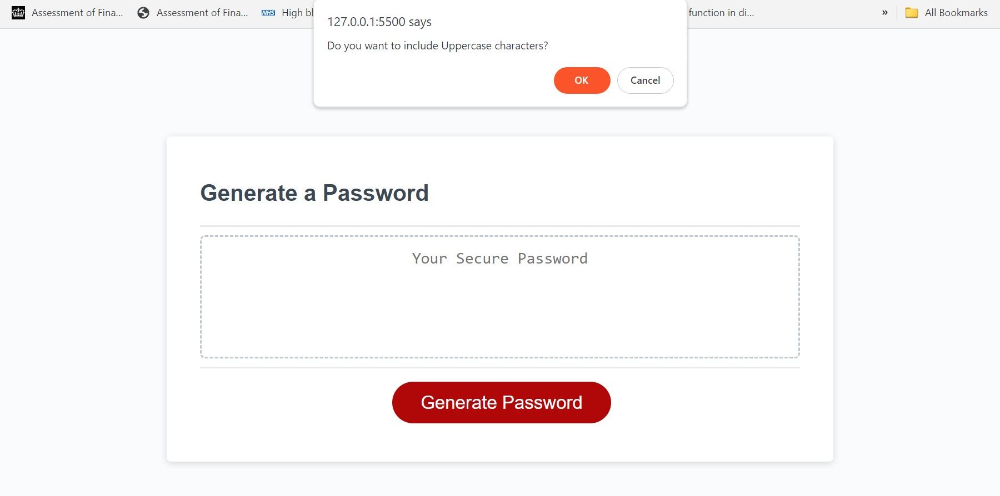
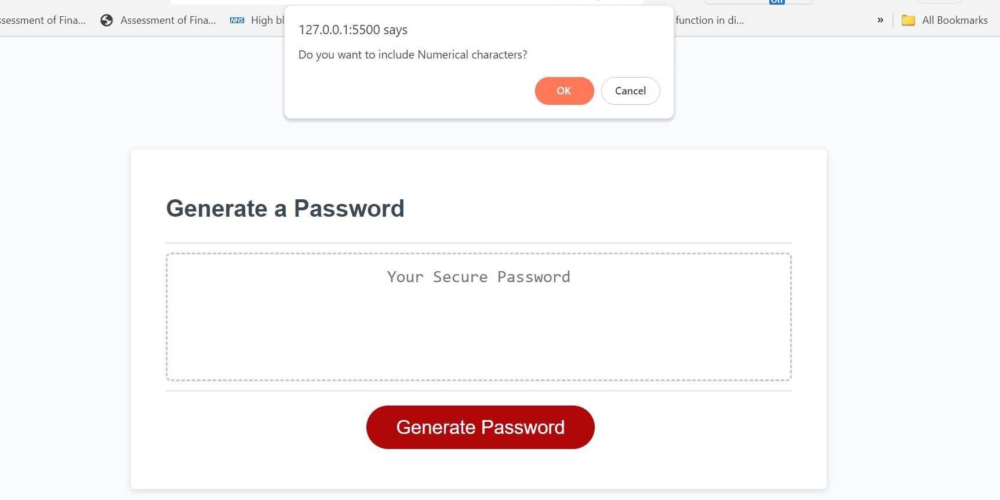
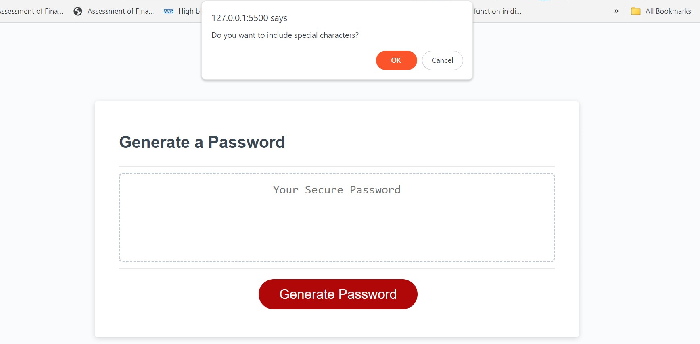
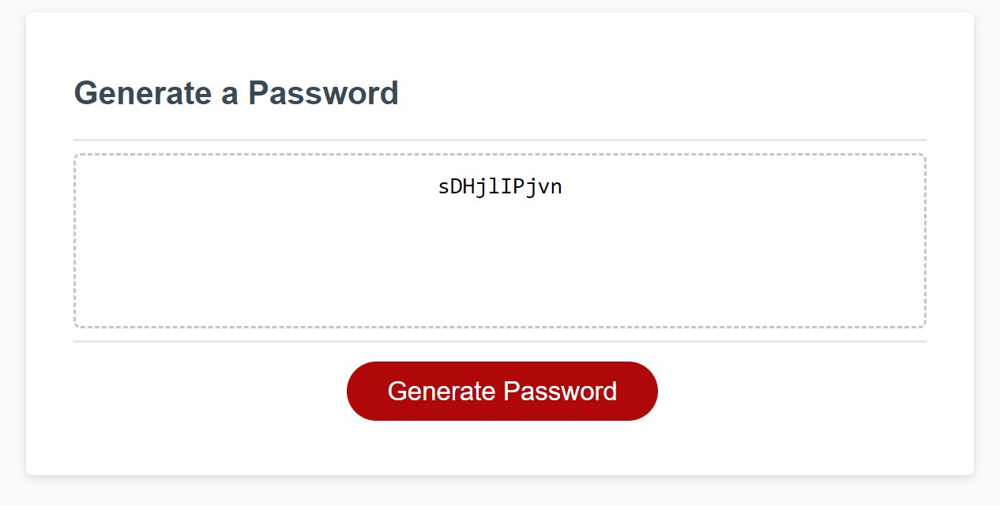

# Password-generator

## Description

This application is designed to provide employees with a convenient tool to generate random passwords based on selected criteria. The app runs in a web browser, featuring a clean and polished user interface with dynamically updated HTML and CSS powered by JavaScript

Acceptance criteria:

* Generate a password when the button is clicked
  * Present a series of prompts for password criteria
    * Length of password
      * At least 8 characters but no more than 128.
    * Character types
      * Lowercase
      * Uppercase
      * Numeric
      * Special characters ($@%&*, etc)
  * Code should validate for each input and at least one character type should be selected
  * Once prompts are answered then the password should be generated and displayed in an alert or written to the page

## Table of Contents

* [Installation](#installation)
* [Images](#Images)
* [Credits](#credits)
* [License](#license)

## Installation

1) git clone git@github.com:username/repo.git
2) Change into project's directory
3) Start application on VS code

## Images 
 
 
 
 
 
 

## Credits

Copyright © 2023 Sumayyah Akther Emama. All Rights Reserved.

## License

Licensed under the MIT license

## Deployment 
